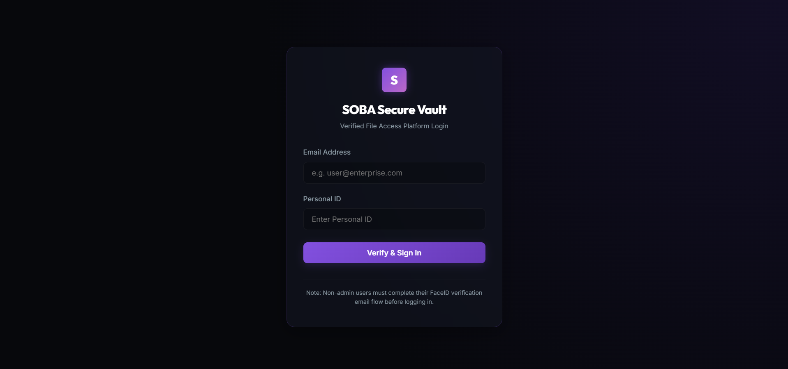
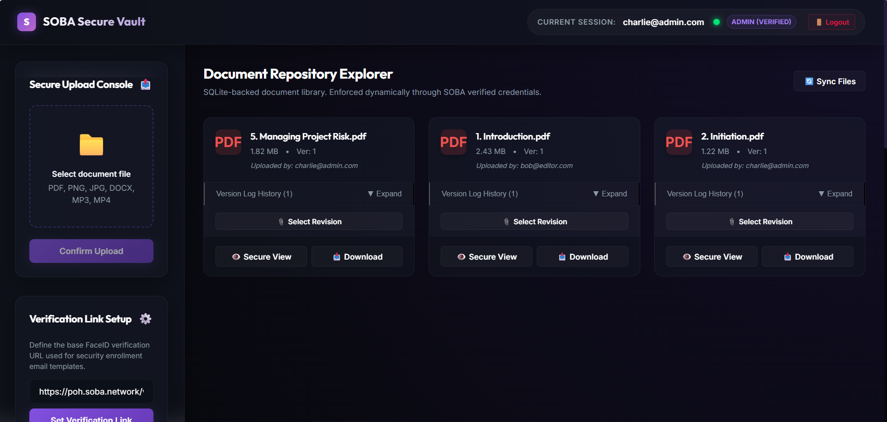
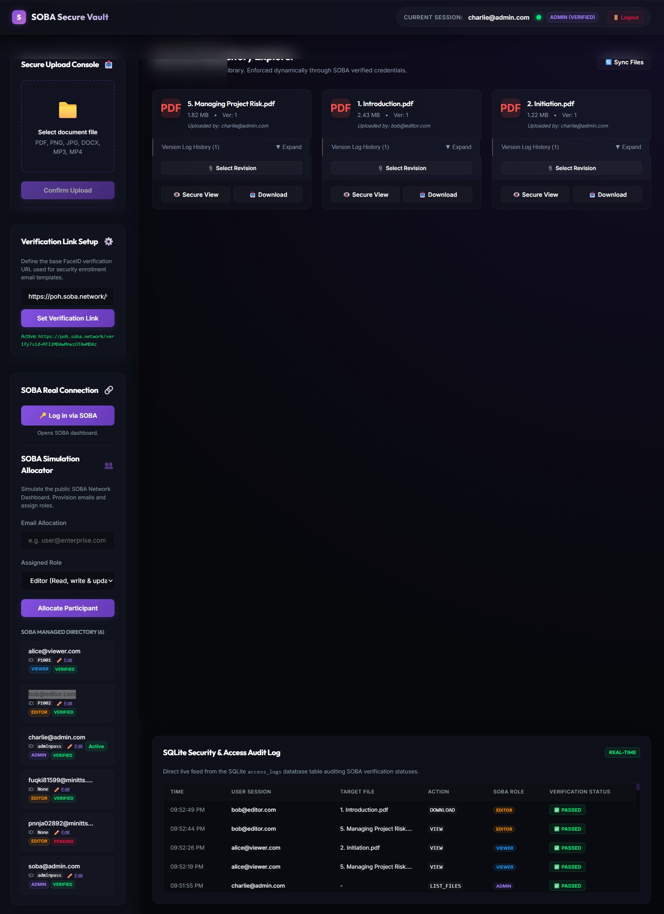
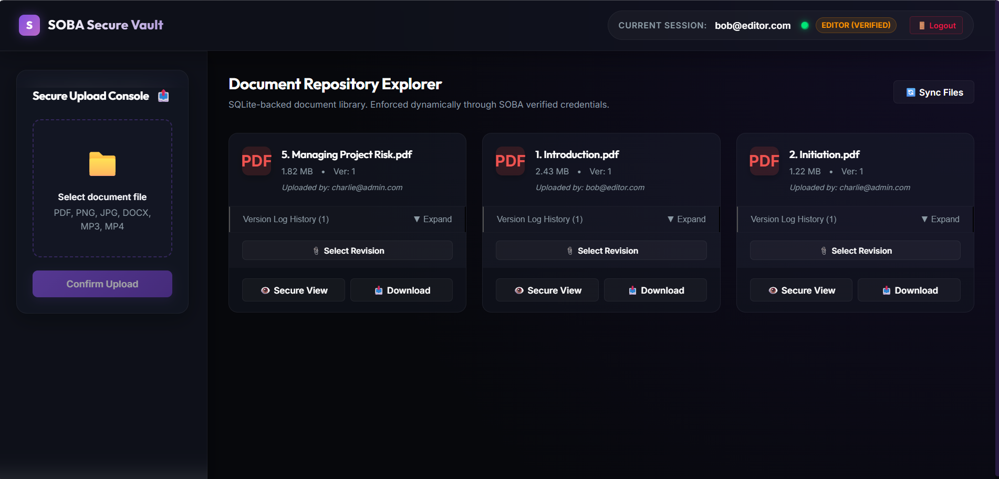
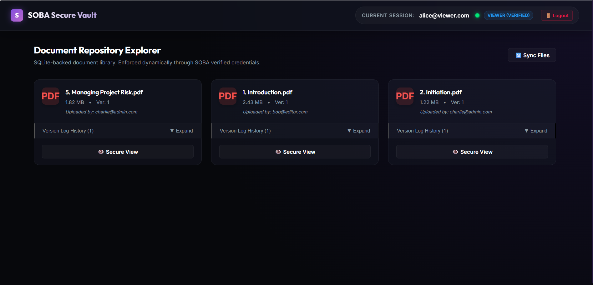
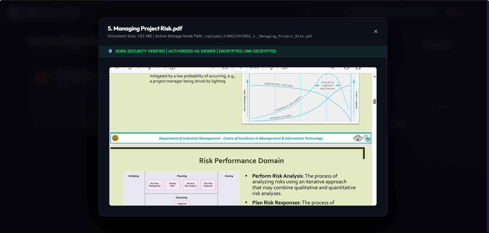
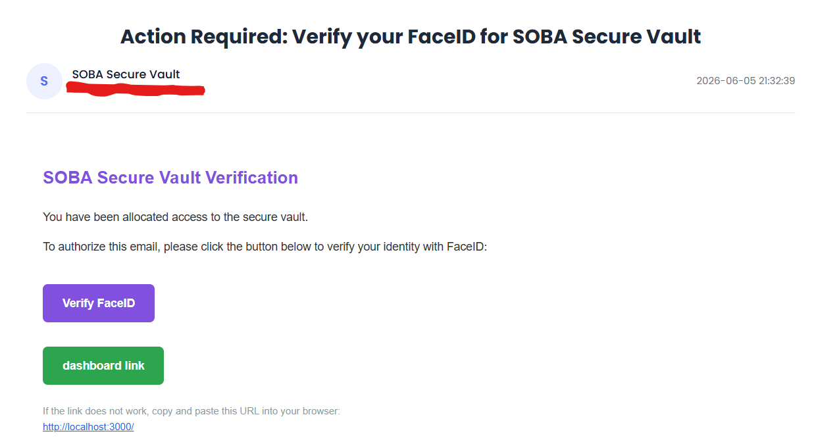
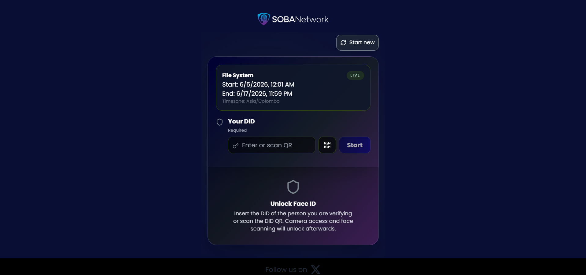
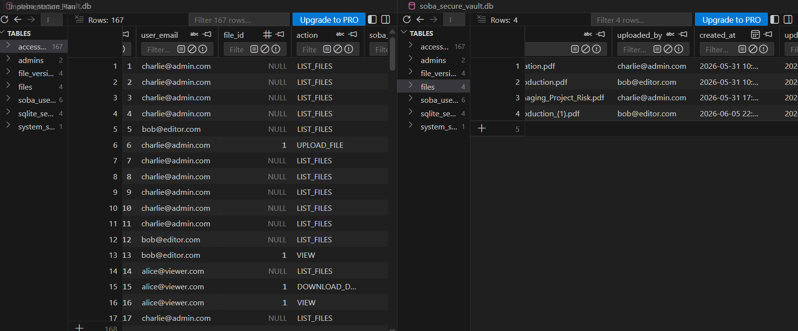

# SOBA-Verified Secure File Access Platform

A premium, secure file access and distribution platform integrated with the **SOBA FaceID Identity Verification** network.

---

## 🚀 Features

- **Secure Login with Identity Verification**: Direct login verification using individual `Personal IDs` combined with a dynamic redirect to the external FaceID portal.
- **Dynamic Admin Control**: Admins can change the active FaceID verification link on the fly from the admin panel, saving it directly to the SQLite database.
- **Verification Callback Handler**: Once the external portal verifies the user's face, it redirects them to our local callback endpoint which automatically validates their status and lets them into the secure dashboard.
- **Role-based File Access Control**: Different roles (`viewer`, `editor`, `admin`) govern who can upload, edit, or access files in the secure vault.
- **Automatic Audit Trails**: Log entries for every file download, upload, and verification attempt.
- **Nodemailer Integration**: Automatically sends out allocation emails containing the login details and a convenient **dashboard link** callback parameter for fast-track authentication.

---

## 💻 Technical Stack

- **Framework**: [Next.js](https://nextjs.org/) (App Router)
- **Language**: JavaScript / Node.js
- **Database**: SQLite (managed with `better-sqlite3`)
- **Styling**: Vanilla CSS with custom animations and custom components
- **Email Delivery**: SMTP via [Nodemailer](https://nodemailer.com/)
- **API Architecture**: Next.js Serverless Route Handlers

---

## 🛠️ Setup & Installation

### Prerequisites
- Node.js (v18 or higher recommended)
- npm or yarn

### 1. Install Dependencies
```bash
npm install
```

### 2. Configure Environment Variables
Create a `.env.local` file in the root directory and define the following variables:
```env
# SMTP Configuration for Email Notifications
SMTP_HOST=smtp.gmail.com
SMTP_PORT=587
SMTP_USER=your-email@gmail.com
SMTP_PASS=your-app-password
SMTP_SENDER_NAME="SOBA Secure Vault"
```

### 3. Run Development Server
```bash
npm run dev
```
Open [http://localhost:3000](http://localhost:3000) in your browser.

---

## 📂 Database Structure (SQLite)

The system initializes a SQLite database (`soba_secure_vault.db`) with the following tables:
- **`soba_users`**: Manages email registry, roles (`viewer`, `editor`, `admin`), verification state, and credentials.
- **`system_settings`**: Stores dynamic global configs (e.g. `verification_link`).
- **`files`**: Meta-information for secure vault files.
- **`access_logs`**: Logs transactions for auditing file access and verification statuses.

---

## 🔗 Key Endpoints

- **`/`**: Login and File Access Dashboard.
- **`/api/auth/login`**: Processes credentials and prepares redirects to the dynamic FaceID link.
- **`/api/soba/verify-callback`**: Validates user redirection back from the FaceID portal and updates verification state.
- **`/api/soba/users`**: REST endpoint to list and allocate users (Admin-restricted).

---

## 📷 Media Showcase

### 🎥 Demo Video
> Application demonstration video.
* [Download/Watch Demo Video](./demo.mp4)

### 🖼️ Project Screenshots

| Feature | Screenshot |
|---------|------------|
| **Verify Page** |  |
| **Admin Dashboard** |  |
| **Admin Dashboard with logs** |  |
| **Editor Page** |  |
| **Viewer Page** |  |
| **File View Page** |  |
| **Email Format** |  |
| **SOBA Verification Page** |  |
| **SQLite Database** |  |
